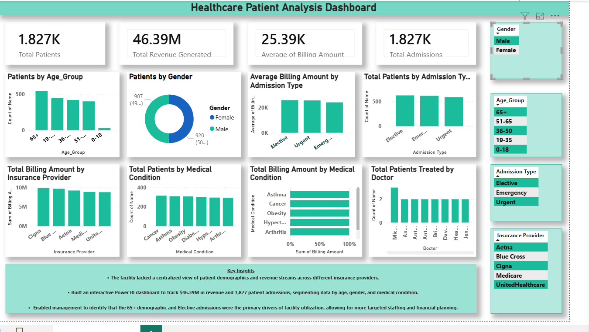

# Healthcare-Patient-Analysis-Dashboard
Healthcare analytics dashboard using Excel and Power BI
## Project Overview
This project analyzes healthcare patient data to identify trends in admissions, billing, medical conditions, and patient demographics. The dashboard helps healthcare management make data-driven decisions.

## Key Insights
- The majority of patients belong to the 36–65 age group.
- Emergency and urgent admissions contribute a large portion of hospital admissions.
- Chronic diseases like Diabetes and Hypertension are common among patients.
- Total hospital revenue generated is 46.39M.
## Dashboard Preview

